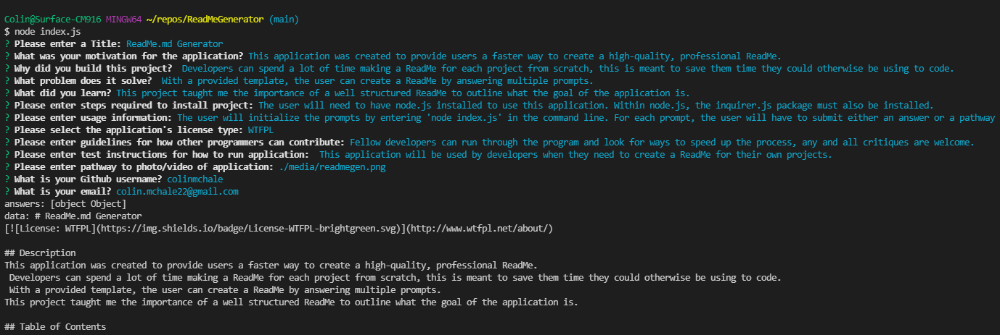

# ReadMe.md Generator

## Description  
This application was created to provide users a faster way to create a high-quality, professional ReadMe.  
 Developers can spend a lot of time making a ReadMe for each project from scratch, this is meant to save them time they could otherwise be using to code.  
With a provided template, the user can create a ReadMe by answering multiple prompts.  
This project taught me the importance of a well structured ReadMe to outline what the goal of the application is.

## Table of Contents  
[Description](#description)   
[Installation](#installation)  
[Usage](#usage)  
[License](#license)  
[Contributing](#contributing)  
[Tests](#tests)  
[Questions](#questions)  

## Installation  
The user will need to have node.js installed to use this application. Within node.js, the inquirer.js package must also be installed.

## Usage  
  
Link to Video Recording of the application being used: [Click Here](https://drive.google.com/file/d/1S7pzfdcAjtAEgNLk_M25y6kzCLePC7aP/view)  
This application will be used by developers when they need to create a ReadMe for their own projects.

## License 
MPL 2.0
[Link to License](https://www.mozilla.org/en-US/MPL/2.0/)

## Contributing  
Fellow developers can run through the program and look for ways to speed up the process, any and all critiques are welcome.

## Tests  
 The user will initialize the prompts by entering 'node index.js' in the command line. For each prompt, the user will have to submit either an answer or a pathway to a file. What the user submits will be rendered in the ReadMe.

## Questions
Link to github: [Click Here](https://github.com/colinmchale)  
Please submit any additional questions you may have in an email to colin.mchale22@gmail.com
